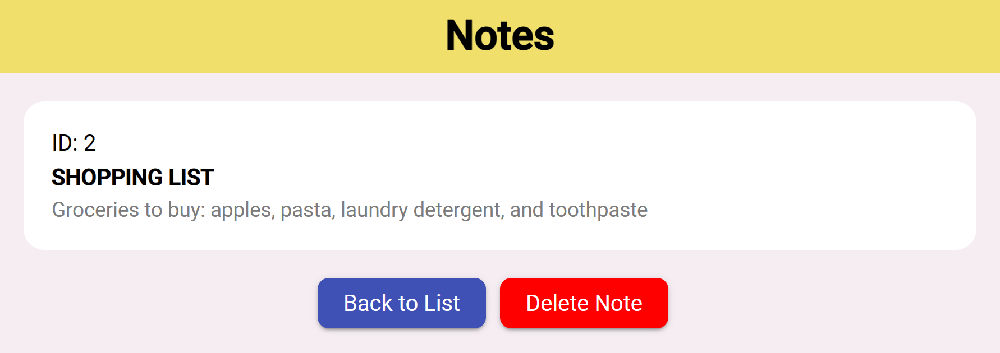

# Angular Notes App

This repository demonstrates a single-page application (SPA) for note taking using Angular 17 and Material Design.

## Features
- <b>Material Design</b>: Provides a modern look and feel
- <b>Note wrapping</b>: Supports wrapping of long notes
- <b>Form validation</b>: Ensures valid data entry
- <b>Routing</b>: Allows for navigation between different views
